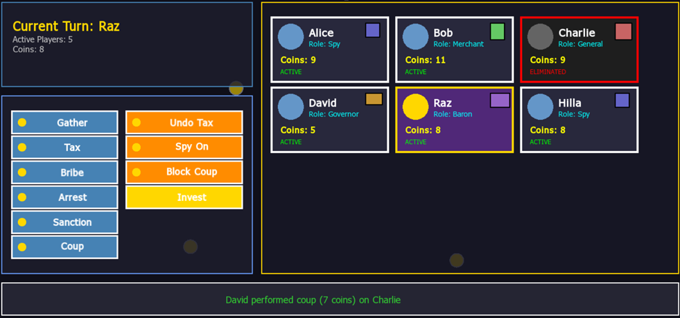

# Coup Game


A feature-rich, GUI-based implementation of the popular card game **Coup** built in C++ using the SFML graphics library. This project recreates the strategic bluffing and deduction game with original character roles, each having unique abilities that affect gameplay dynamics.



## Introduction

Coup is a strategic card game for 2-6 players where participants take on different roles in a dystopian future, using influence and deception to eliminate opponents and be the last player standing. This implementation features:

- **GUI-based gameplay** using SFML for an intuitive gaming experience
- **Six unique character roles** with distinct abilities and gameplay mechanics
- **Turn-based strategy** with both basic and special actions
- **Real-time interaction** through a modern graphical interface
- **Comprehensive testing suite** ensuring robust game logic

### Character Roles

The game includes six specialized roles, each with unique abilities:

- **Governor** - Enhanced taxation (3 coins instead of 2) and can undo other players' tax actions
- **Spy** - Intelligence gatherer who can reveal opponent coins and block arrest actions
- **Baron** - Investment specialist who can triple coins (pay 3, get 6) and receives compensation when sanctioned
- **General** - Can block coup attempts for 5 coins and has defensive capabilities  
- **Judge** - Can block bribe actions and imposes penalties on attackers
- **Merchant** - Generates passive income and has alternative payment methods for penalties

## Installation Instructions

### System Requirements

- **C++17** compatible compiler (g++ recommended)
- **SFML 2.5+** graphics library
- **GNU Make** or **CMake** for building
- **Linux/Windows/macOS** (tested on Linux)

### Dependencies Installation

#### Ubuntu/Debian:
```bash
sudo apt update
sudo apt install build-essential libsfml-dev g++ make
```

#### macOS (with Homebrew):
```bash
brew install sfml gcc make
```

#### Windows (with vcpkg):
```bash
vcpkg install sfml
```

### Building the Project

1. **Clone the repository:**
   ```bash
   git clone https://github.com/Raz99/Coup-Game.git
   cd Coup-Game
   ```

2. **Build using Make:**
   ```bash
   make all
   ```

3. **Alternative build commands:**
   ```bash
   make GUI        # Build and run GUI application
   make Main       # Build and run example demo
   make test       # Build and run tests
   make valgrind   # Valgrind - Memory check
   make clean      # Clean - Remove all generated files
   ```

## How to Run

### Launch the GUI Game
```bash
make GUI
# or directly:
./coup_game
```

### Font Requirements
The game uses the included `tahoma.ttf` font located in the `resources/` directory. Ensure this file is present for proper text rendering.

## Game Overview

### Basic Rules

- **Players:** 2-6 participants
- **Objective:** Be the last active player remaining
- **Starting conditions:** Each player begins with 0 coins and is assigned a random role
- **Victory condition:** Eliminate all other players through strategic actions

### Core Actions

Every player can perform these basic actions regardless of their role:

| Action | Cost | Regular Effect | Notes |
|--------|------|--------|-------|
| **Gather** | Free | +1 coin | Can be blocked by sanctions |
| **Tax** | Free | +2 coins | Can be blocked by sanctions |
| **Bribe** | 4 coins | Extra turn | Allows additional action |
| **Arrest** | Free | Steal 1 coin from target | Cannot target same player twice consecutively |
| **Sanction** | 3 coins | Block target's economic actions | Prevents gather/tax until their next turn |
| **Coup** | 7 coins | Eliminate target player | Removes player from game |

### Special Rules

- **Mandatory Coup:** Players with 10+ coins must perform a coup
- **Reactive Abilities:** Some role abilities can be used outside of turn order
- **Economic Blocking:** Sanctioned players cannot use gather or tax actions

## Controls & Gameplay (GUI)

### Game Setup
1. **Launch** the application
2. **Enter player names** when prompted (2-6 players)
3. **Roles are automatically assigned** randomly to players
4. **Game begins** with the first player's turn

### During Gameplay
- **Player cards** display current coins, role, and status
- **Action buttons** show available moves for the current player
- **Target selection** appears when actions require choosing an opponent
- **Message area** provides feedback on actions and results
- **Turn indicator** highlights the active player

### Interface Elements
- **Player Information Cards:** Show name, role, coin count, and status
- **Action Panel:** Buttons for available actions (context-sensitive)
- **Game Messages:** Real-time feedback and action results
- **Role-specific Buttons:** Special abilities appear when applicable

### Special Ability Usage
- **Governor:** "Undo" button appears when someone uses tax
- **Spy:** "Spy On" for intelligence gathering
- **Baron:** "Invest" button for wealth multiplication
- **General:** "Block Coup" option when coup attempts occur
- **Judge:** "Block Bribe" when bribe actions are used
- **Merchant:** Automatic bonuses at turn start

## Acknowledgments

- **SFML Library:** For graphics and windowing capabilities
- **Doctest Framework:** For unit testing infrastructure
- **Original Coup Game:** Created by Rikki Tahta
- **Font:** Tahoma typeface for UI text rendering
